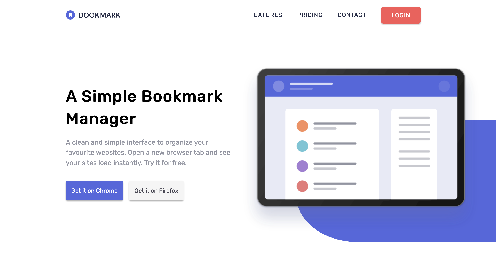

# Frontend Mentor - Bookmark landing page solution

This is a solution to the [Bookmark landing page challenge](https://www.frontendmentor.io/challenges/bookmark-landing-page-5d0b588a9edda32581d29158) on Frontend Mentor

## Table of contents

-  [Overview](#overview)
   -  [The challenge](#the-challenge)
   -  [Screenshot](#screenshot)
   -  [Links](#links)
-  [My process](#my-process)
   -  [Built with](#built-with)
   -  [What I learned](#what-i-learned)
   -  [Continued development](#continued-development)
   -  [Useful resources](#useful-resources)
-  [Author](#author)

## Overview

### The challenge

Your users should be able to:

-  View the optimal layout for the site depending on their device's screen size
-  See hover states for all interactive elements on the page
-  Receive an error message when the newsletter form is submitted if:
-  The input field is empty
-  The email address is not formatted correctly

### Screenshot



### Links

-  Live Site URL:

## My process

### Built with

-  Semantic HTML5 markup
-  Flexbox
-  Mobile-first workflow
-  Sass - CSS preprocessor
-  Vanilla JS
-  ES6 Modules

### What I learned

```html
<i class="fab fa-facebook-square social-icon social-icon-fb"></i>
```

This project was my first time using NPM through which I was able to install multiple useful technologies to produce this project, including Font Awesome's icon library as demonstrated above. These icons come with great JavaScript support already built in, which provides much greater hover targets for transitioning icons based off a user actions. I was also able to successfully install the popular bundler Parcel, which provides a massive boost to productivity efficiency by compiling all of our CSS and JavaScript based technologies (Sass, Typescript, etc) all in one go on every save.

```scss
.hero {
   &-wrapper {
      background: url('/images/bg-blue-shape.svg') no-repeat -45% 15% / 150%;
      @include mq(hero-illustration) {
         background-position: calc(100% + 100px) 15%;
         background-size: 80% 400px;
      }
   }
}
```

As mentioned in the previous paragraph, this project was a major step up for me in my whole development process, and as such for this project I used Sass to organise all my CSS. I adopted the 7-1 pattern as described on the official Sass docs, whilst making great use of multiple other features a pre-processor provides us with. These include nesting with the '&' operator to inherit the parent selector, as well as basic mixins which are able to dynamically generate re-usable sections of CSS code based on potential arguments we provide to them in a function like syntax.

I included the above code example specifically to touch upon the blue background SVG which we had to manually create, as well as control in a responsive manner as the design responded. In order to create this shape, I had to research additional information about the basics of XML code, and the tags we can use to create desired shapes such as the `<cicle>` tag. In order to control the asset, I created two different versions of the SVG shape regarding its width, including one very wide version for desktop viewports. I combined this with a fluid horizontal width to allow it to keep growing for ultra-wide displays, whilst staying pinned to the middle of the hero image which was being centered by the max-width utility class.

```scss
&:hover::after {
   transform: scaleX(1);
   transform-origin: left;
}
```

I adapted the original design slightly to play around with more complicated transitions and hover effects, since the original design merely required a colour change on hover for the primary navigation links. As displayed above, I applied a pseudo-element to each link which created a small line that would translate horizontally to fill up the links full-width on hover, whilst then performing the same effect but in the opposite direction when the hover stopped.

```scss
.card-brwsr {
   @include flexParent(row, center, unset);
   flex-wrap: wrap;
   & > * {
      flex-basis: 340px;
   }
}
```

My original solution to controlling the 'browser-extension' cards resolved around applying a standard `flex-wrap` to the parent, with a fixed `flex-basis` value to reproduce that classic wrapping behaviour. However, I did also apply a `flex-grow: 1` to each flex-child, which at tablet viewports caused the bottom flex-child to become stretched to fill up all remaining space within the container. Once I removed the flex-grow value from each child, the wrapping behaviour still occured but without the stretching behaviour attatched to it. Although it did create more whitespace around the viewport edges, I didn't want to sacrifice the width of each card for flex-wrap's traditional behaviour.

```scss
@keyframes left-right {
   0% {
      transform: translateY(-50%) translateX(0);
   }
   33% {
      transform: translateY(-50%) translateX(10px);
   }
   66% {
      transform: translateY(-50%) translateX(-10px);
   }
   100% {
      transform: translateY(-50%) translateX(0);
   }
}
```

Alongside experimenting with more complex transitions on the primary navigation links, I decided to implement my first 'official' animation within a project as well. It was quite hard to find an appropiate use for it, since I would often go too far with the desired effect, ultimately detracting from its appropriateness within the site. However, I do think the animation displayed above was minimal enough to not impact the site's effectiveness, although I look forward to refining my ability and creating more advanced movements, if only to deepen my understanding of the language.

### Continued development

I still organised a lot of my styles into the same Sass partials, since I found this more useful when building out the site so I wasn't constantly creating new files all the time. However, grouping styles together to this extent goes against the modular purpose of splitting your code up into re-usable chunks, so therefore I would at least like to finish the project with a much larger components folder.

I feel as if now I am becoming relatively confident with building single-page layouts and re-creating them close to the original design. I would like to branch out furthe in talking larger scale projects, such as multi-page sites which would take my organisation skills to the next level, as well as my CSS.

### Useful resources

-  [CSS Animation - Introduction](https://www.youtube.com/watch?v=YszONjKpgg4&ab_channel=WebDevSimplified) - My first introduction to CSS animation, explaining all the fundamental properties and their behaviour.

-  [CSS Performant Animations](https://www.youtube.com/watch?v=4PStxeSIL9I&ab_channel=WebDevSimplified) - This was great to learn early on since I used to make the mistake of transitioning everything on a class, instead of specifying certain properties to be more performant.

## Author

-  Website - [Joshua Jameson-Wallis](https://joshuajamesonwallis.com)
-  Linkedin - [Joshua Jameson-Wallis]()
